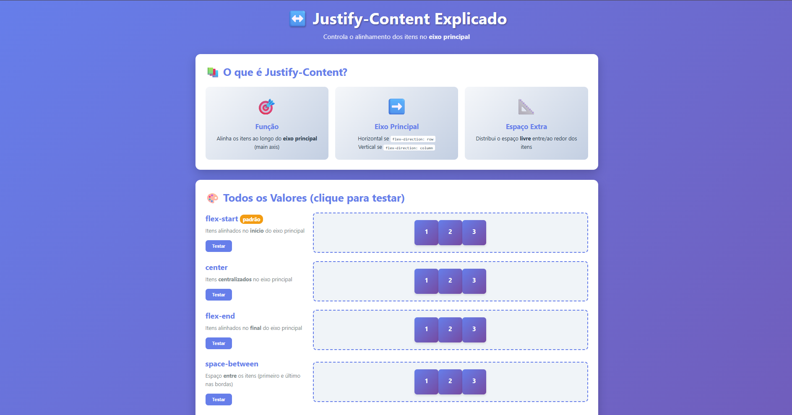

# 🎯 Justify-Content Explicado - Playground Interativo

Este repositório apresenta um playground interativo simples e direto para entender visualmente a propriedade **`justify-content`** do CSS Flexbox.

---

## 🧐 O que é `justify-content`?

A propriedade `justify-content` é fundamental no Flexbox, sendo responsável por:

| Conceito | Descrição |
| :--- | :--- |
| **Função** | **Alinha e distribui** os itens flexíveis ao longo do **Eixo Principal (Main Axis)** do Container Flex. |
| **Eixo Principal** | A direção principal em que os itens estão dispostos (Horizontal por padrão - `row`, ou Vertical se você usa `flex-direction: column`). |
| **Espaço Extra** | Controla como o espaço restante (não ocupado pelos itens) é distribuído entre os itens ou ao redor deles. |

---

## ✨ Todos os Valores de `justify-content`

No playground, você pode clicar em cada valor e ver imediatamente como o alinhamento dos itens muda no Eixo Principal.

| Valor | Descrição |
| :--- | :--- |
| **`flex-start` (Padrão)** | Os itens são alinhados no **início** do Eixo Principal. |
| **`center`** | Os itens são **centralizados** como um bloco no Eixo Principal. |
| **`flex-end`** | Os itens são alinhados no **final** do Eixo Principal. |
| **`space-between`** | Distribui o espaço **apenas entre** os itens. O primeiro item fica na borda inicial e o último na borda final. |
| **`space-around`** | Distribui espaço **ao redor** de cada item. Note que o espaço nas bordas é metade do espaço entre os itens. |
| **`space-evenly`** | Distribui o espaço de maneira **totalmente uniforme** entre os itens e também nas bordas. |

---

## 🤝 Contribuição

Ideias para aprimorar o visual, ou sugestões de como explicar melhor outros conceitos do Flexbox são sempre bem-vindas!
